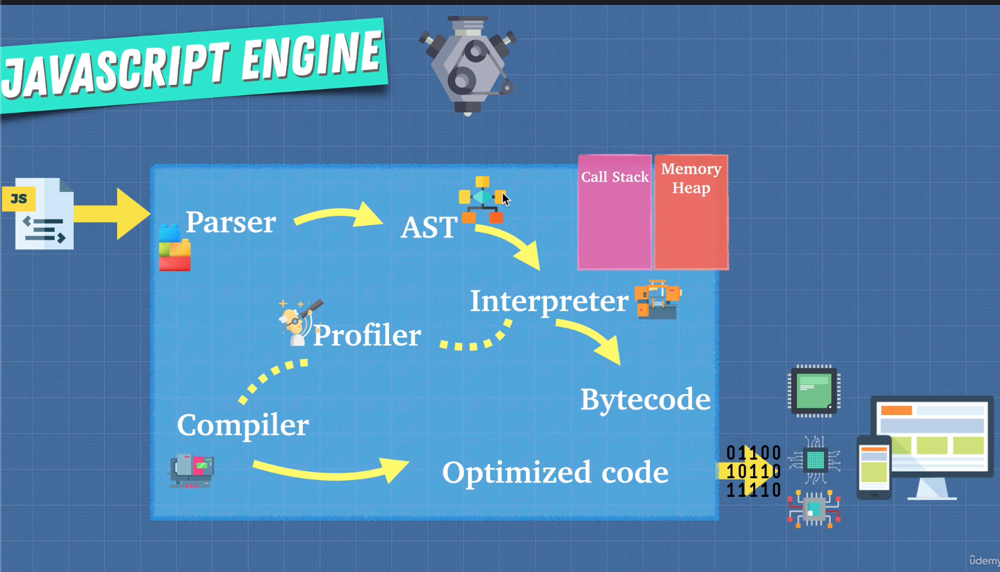
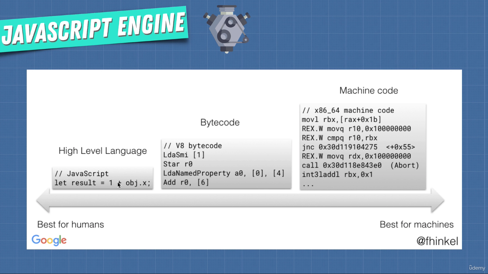

# JavaScript - Advanced Concepts 🚀

## JavaScript Foundation

### 🦫 Javascript Engine

- The machine can understand what a javascript file speaks about - a translator.
- Many engines - ECMAScript engines
  - Chakra
  - SpiderMonkey - Firefox (_Brendan Eich_)
  - V8 (in C++) - introduced by Google 2008
- The js files gets understood by the engine
- JS used to be **slow**. Google build a browser to control more of the market.
- First Creator => _Brendan Eich_

**AST**: an _abstract syntax tree_ (AST), or just _syntax tree_, is a tree representation of the abstract syntactic structure of source code written in a programming language. Each node of the tree denotes a construct occurring in the source code.

## 2️⃣ ways to run JavaScript ⬇️

### INTERPRETERS

- It translates and reads the files line by line on the flight.
- Taking a set of instructions and returning an answer, doing something with that code.

### COMPILERS

- Works ahead of time to create a translation of the code and compiles it to a language that can be understood by the machine.
- Writes a new program to a new language.
- Lower level language - machine code

### Why use one against the other? 🤔

- **Babel** is a Javascript compiler that takes modern JS code and returns browser compatible JS (older JS code).
- **Typescript** is a _superset_ of Javascript that compiles down to Javascript.
- Both of these do exactly what **compilers** do: Take one language and convert into a different one.

- _Interpreters_ are quick in running. 🏃 BUT, when you're running the same code more than once, it's getting slow! 🐢
- _Compilers_ help with that. Doesn't need to repeat the translation for loops for example => _**OPTIMIZATION**_ ✨

## JIT COMPILER!