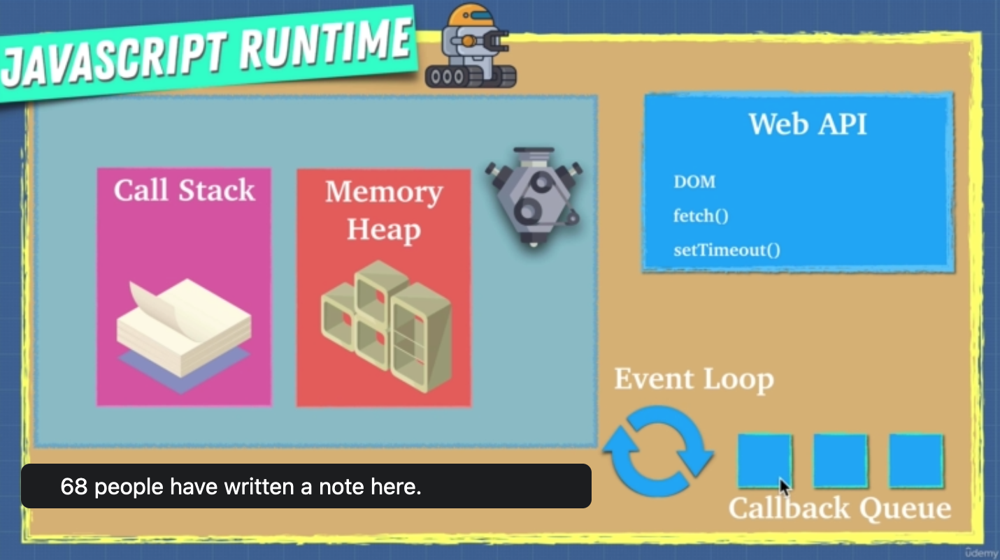
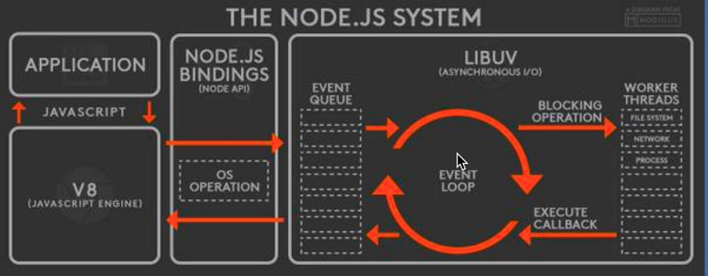

# JavaScript - Advanced Concepts 🚀

## JavaScript Foundation

### 🦫 Javascript Engine

- The machine can understand what a javascript file speaks about - a translator.
- Many engines - ECMAScript engines
  - Chakra
  - SpiderMonkey - Firefox (_Brendan Eich_)
  - V8 (in C++) - introduced by Google 2008
- The js files gets understood by the engine
- JS used to be **slow**. Google build a browser to control more of the market.
- First Creator => _Brendan Eich_


**AST**: an _abstract syntax tree_ (AST), or just _syntax tree_, is a tree representation of the abstract syntactic structure of source code written in a programming language. Each node of the tree denotes a construct occurring in the source code.
[AST Explorer](https://astexplorer.net/) 🌳

## 2️⃣ ways to run JavaScript ⬇️

### INTERPRETERS

- It translates and reads the files line by line on the flight.
- Taking a set of instructions and returning an answer, doing something with that code.

### COMPILERS

- Works ahead of time to create a translation of the code and compiles it to a language that can be understood by the machine.
- Writes a new program to a new language.
- Lower level language - machine code


### Why use one against the other? 🤔

- **Babel** is a Javascript compiler that takes modern JS code and returns browser compatible JS (older JS code).
- **Typescript** is a _superset_ of Javascript that compiles down to Javascript.
- Both of these do exactly what **compilers** do: Take one language and convert into a different one.

- _Interpreters_ are quick in running. 🏃 BUT, when you're running the same code more than once, it's getting slow! 🐢
- _Compilers_ help with that. Doesn't need to repeat the translation for loops for example => _**OPTIMIZATION**_ ✨


## JIT COMPILER! 🤩

- Browsers started mixing compilers to make the engine faster!
- AST -> Interpreter -> Bytecode - not as low level as machine code (Ignition! 🚀)
- Interpreter -> Profiler -> Compiler -> Optimized code!
- The compiler replaces the sections of bytecode that can be improved with optimized code, **constantly**!
- The overall execution speed is improving!

## Is javascript an _interpreted_ language? 🤔

- Yes! In the beginning stages (see _SpiderMonkey_).
- But things have evolved now. Depends on the implementation, so not technically!!

### Code Optimization

- Problematic issues:
  - eval()
  - arguments
  - for in
  - with
  - delete
  - hidden classes
  - inline caching
- We should write code that is predictable and does not confuse the compiler!
- **Memoization**

  - Memoization is a way to cache a return value of a function based on its parameters. This makes the function that takes a long time run much faster after one execution. If the parameter changes, it will still have to reevaluate the function.

  ```js
  // Bad Way
  function addTo80(n) {
    console.log('long time...');
    return n + 80;
  }

  addTo80(5)
  addTo80(5)
  addTo80(5)

  // long time... 85
  // long time... 85
  // long time... 85

  // Memoized Way
  functions memoizedAddTo80() {
  let cache = {}
  return function(n) { // closure to access cache obj
  if (n in cache) {
  return cache[n]
  } else {
  console.log('long time...')
  cache[n] = n + 80
  return cache[n]
  }
  }
  }
  const memoized = memoizedAddTo80()

  console.log('1.', memoized(5))
  console.log('2.', memoized(5))
  console.log('3.', memoized(5))
  console.log('4.', memoized(10))

  // long time...
  // 1. 85
  // 2. 85
  // 3. 85
  // long time...
  // 4. 90
  ```

- **Inline Caching**

  - If this code gets optimized to return only 1 name, then the computer would have to do a lot more work if you needed to return a different user.

  ```js
  function findUser(user) {
  return `found ${user.firstName} ${user.lastName}`
  }

  const userData = {
    firstName: 'Brittney',
    lastName: 'Postma
  }

  findUser(userData)

  // if this findUser(userData) is called multiple times,
  // then it will be optimized (inline cached) to just be 'found Brittney Postma'
  ```

- **Hidden Classes**

  - By setting these values in a different order than they were instantiated, we are making the compiler slower because of hidden classes. Hidden classes are what the compiler uses under the hood to say that these 2 objects have the same properties. If values are introduced in a different order than it was set up in, the compiler can get confused and think they don't have a shared hidden class, they are 2 different things, and will slow down the computation. Also, the reason the delete keyword shouldn't be used is because it would change the hidden class.

  ```js
  function Animal(x, y) {
  this.x = x;
  this.y = y;
  }

  const obj1 = new Animal(1, 2);
  const obj2 = new Animal(3, 4);

  obj1.a = 30;
  obj1.b = 100;
  obj2.b = 30;
  obj2.a = 100;

  delete obj1.x = 30;
  ```

### Web Assembly

- The compiling has to happen on the browser.
- All browsers have to agree on an executable format.

                  ⬇️   ⬇️   ⬇️

- **Standard Binary Executable Format**
- we don't have to do all these steps, interpreting, compiling etc on the engine.

### Call Stack & Memory Heap 🧱

- We need a place to store information and a place where we keep track of what is happening in our code and _where_ we are in the code.
- Both are part of the javascript engine.
- Call Stack -> First In Last Out mode (FILO)
- ⚠️ Simple variables are stored in the stack, and complex structures (eg objects) are stored in the memory heap.
- The call stack can be exceeded and then we have what we call **stack overflow**.

### Garbage Collection 🗑️

- JavaScript is a garbage collected language.
- After allocated memory has been used, it's cleaned when is not needed any more.
- Only the useful data remains.
- The _garbage collector_ prevents memory leak! -> Mark and Sweep! 🌪️
- ⚠️ **False** impression: we don't have to do memory management...🤔

### Memory Leak 💦

- Fill memory heap with more and more data till the program crashes.
- The garbage collection cannot work on a reserved variable.
- _Why we try to avoid using a lot of global variables?_ 🌐
- These memory slots are always occupied during the execution of the program and cannot be managed by the garbage collector.
- _What about Event Listeners?_
- We never remove them after we use them! So they constantly keep a place in the memory.
- `setInterval()`
- The objects inside are never to be picked by the garbage collector, unless we **clear the interval**!

### Single Threaded 🧵

- Only one set of instructions is running at a time!
- It has only **one call stack**!
- JavaScript is **synchronous**. This is a problem for long running tasks.
- BUT! Most of the time, we never use the javascript engine alone. We have asynchronous code that helps ▶️ **_JAVASCRIPT RUNTIME_**

### JavaScript Runtime 🌪️

- The Web API comes with the browser.
- Can do a variety of things: send HTTP requests, listen to events, delay execution, caching, database storage.
- Access what the Web API provides => `window`
- Under the hood, browsers use low level languages to perform these operations and make JavaScript look like it is running faster.
- These Web APIs are **asynchronous**.
- The callbacks are sent to the Web APIs.
- the `Event Loop` is constantly running, waiting for the `Call Stack` to empty.
- The `Event Loop` is pushing the callback from the `Callback Queue` to the `Call Stack`.



### Node.JS 🧰

- A C++ program.
- A JavaScript runtime built on Chrome's V8 JavaScript engine.
- Till 2009, JS was run only inside the browser.
- The browser does not have access to the local files, that would be a security risk.
- With Node.JS we can access file systems.
- The `V8` helps understanding the JavaScript and the `LIBUV` helps with the background tasks.
- Node.JS has `global` _instead of `window`_.
- This is why it's a server side platform, based on asynchronous I/O that is `non-blocking`.
- `Worker-threads` in the background.


