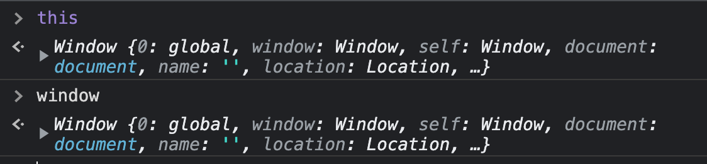

# JavaScript Foundation II

### Execution Context 🔫

- When JS sees the `()` of a function, it creates an _Execution Context_.
- Execution context is **added to the stack**.
- The basic execution context that runs is called the _Global Execution Context_.
  - first layer => `global()`

#### 🤔 _Whenever code runs in JS, it runs in an execution context. True or False?_

True! All code is part of an execution context; either global or part of some function.

- The Global Execution Context gives us:
  - a `global object`
  - the keyword `this`

---

#### 🤔 _Is `this` the same as `window`?_

Yes!

#### ⚠️ In Node.JS the `window` is called `global`!

- We can assign variables to the global object. This is where the `creation phase` ends. 🎨
- Then comes the `execution phase`, when we actually run our code. 🌪️
