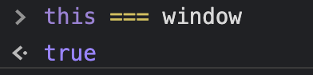

# JavaScript Foundation II

### Execution Context 🔫

- When JS sees the `()` of a function, it creates an _Execution Context_.
- Execution context is **added to the stack**.
- The basic execution context that runs is called the _Global Execution Context_.
  - first layer => `global()`

#### 🤔 _Whenever code runs in JS, it runs in an execution context. True or False?_

True! All code is part of an execution context; either global or part of some function.

- The Global Execution Context gives us:
  - a `global object`
  - the keyword `this`
  - `Hoisting`


---

#### 🤔 _Is `this` the same as `window`?_

Yes!



#### ⚠️ In Node.JS the `window` is called `global`!

- We can assign variables to the global object. This is where the `creation phase` ends. 🎨
- Then comes the `execution phase`, when we actually run our code. 🌪️
- A _Function Execution Context_ is added above the global one every time we have a new function (and the stack gets created). 🧱

### Lexical Environment 📚

- a.k.a. Lexical Scope, Lexical Analysis
- It refers to _where we write something_, every time we create an execution context.
- Compilers are doing lexical analysis => where is the location of the words, in which execution context are there to be found.
- Every function offers a different execution context, hence a new lexical environment is created.
- 💡 _Execution context tells you which lexical environment is currently running._
- In JS, our **lexical scope** (available data + variables where the function was defined) determines our available variables. _Not where the function is called_ (dynamic scope)!
- First lexical environment => Global Lexical Environment

### Hoisting 🪢

- Allocate space in our memory heap, to make sure the engine is ready for the execution.
- The moving the variables or function declarations on the top of their respective environment.
- JS allocates memory for the variables and functions during the creation phase before it executes it.
- **Functions are fully hoisted in javascript**. This is _not true for variables_, where the name is reserved, but the value is not assigned during hoisting.
- ### ⚠️
  From the variables, only the `var` gets hoisted! E.g. if we try to use a variable before its declaration with `let`, it will show `undefined`!
- Function declarations VS function expressions:
  - Declaration:
  ```js
  function sing() {
    console.log('do re mi!');
  }
  ```
  - Expression:
  ```js
  var sing2 = function () {
    console.log('la si do!');
  };
  ```
  During the creation phase, the `sing2` is going to be hoisted and assigned `undefined`, until its execution phase. So, I cannot call it before its line of declaration.


#### ⚠️ _Every time_ we call a function, we have a creation phase and an execution phase.

---

### 🧩 Quiz!

```js
var favouriteFood = 'grapes';

var foodThoughts = function () {
  console.log('Original favourite food: ' + favouriteFood);

  var favouriteFood = 'sushi';

  console.log('New favourite food: ' + favouriteFood);
};

foodThoughts();
```

> // P.s. when you change the 'var' to 'const' technically there is still hoisting happening. That is why you get a reference error instead of looking at the global favouriteFood variable. let and const hoist but you cannot access them before the actual declaration is evaluated at runtime. So the engine says, "ya there is a favouriteFood variable here but you can't access it yet"

### 💡 Answer!

Original favourite food: `undefined`
New favourite food: `sushi`

### ✏️ Explanation

**Hoisting happens anew in every new execution context!**
So, when we enter the `foodThoughts()` function, the `favouriteFood` variable gets re-hoisted _at the beginning of the new execution context_!
=> Hoisting should be avoided every time possible.

### 🧩 Quiz2!

```js
function bigBrother() {
  function littleBrother() {
    return 'it is me!';
  }
  return littleBrother();
  function littleBrother() {
    return 'no me!';
  }
}

bigBrother();
```

### 💡 Result

```
"no me!"

```

### Function Invocation 📞

- Invocation = Call = Execution => running the function with `()`.
- Function expression get defined at `run` time.
- Function declaration gets defined at `parse` time.
- Function invocation provides:
  - `.this`
  - arguments => is an object available to us after we create a new execution context with a function

### Arguments Keyword 🔑

- to be able to work with the `arguments` keyword:
  ```js
  Array.from(arguments);
  ```
- Now we can use array methods on arguments!
- **_Spread operator_** => (...args)
- Each execution context creates a new object.

### Variable Environment

- Each execution context has its own variable environment.

### Scope Chain ⛓️

- Each execution context has its link to the outside world, to its parent.
- This outside environment defines where the function is sit lexically.
- **_Lexical scope_** -> where the function is defined and available variables.
- **_Dynamic scope_** -> where the function is called

#### ⚠️ Leakage of global variables

When variables are not defined through keywords _var_, _let_ _const_. To avoid this => `'use strict'`

### Function scope vs block scope

- in function scope, we cannot access the "insides" of a function
- `const` and `var` are block scoped

### Global Variables

- polluting the global namespace 🪐

### IIFE

-

```js
(function () {})();
```

- putting the function in local scope, so we avoid collisions!
- NOT a function declaration, but a _function expression_
- the function is **_anonymous_**
